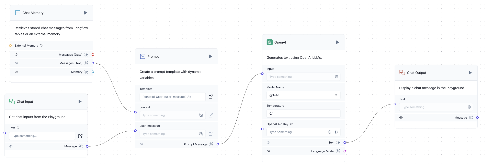
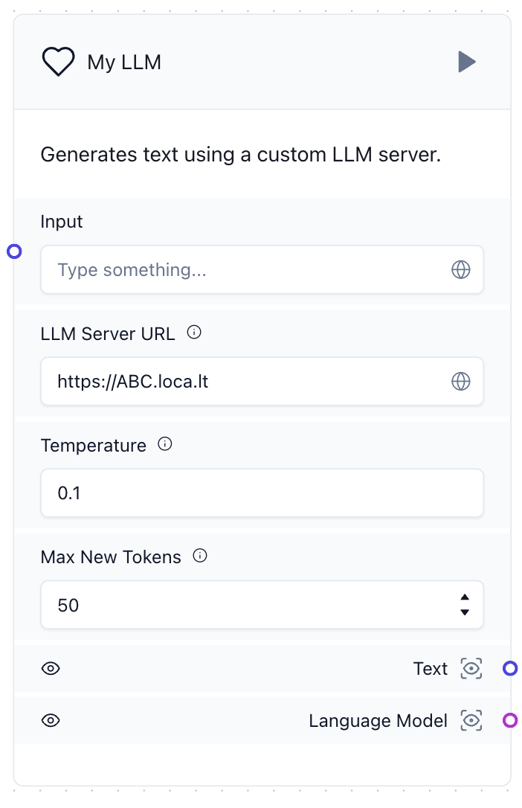
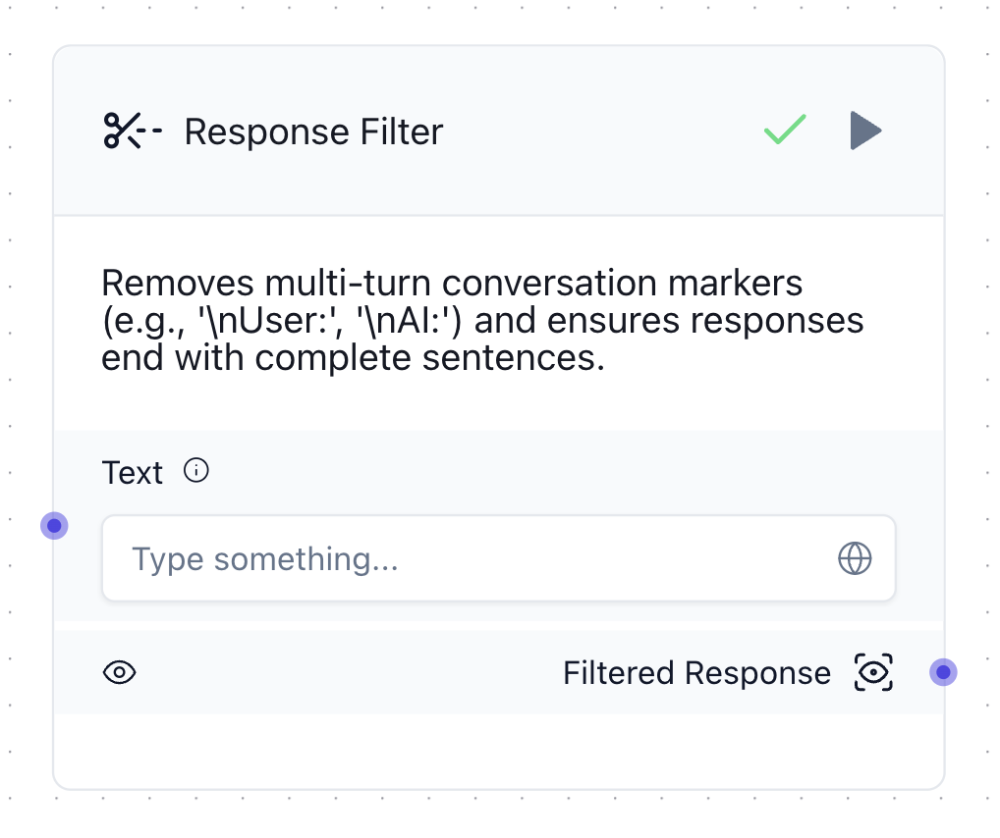
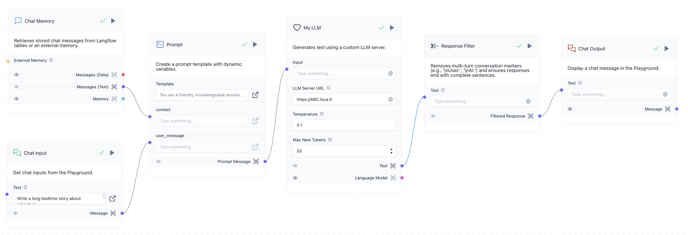

# Introduction

In this session, we will learn **LangFlow**, a powerful visual tool for creating GenAI workflows enhanced by 
knowledge bases and multi-agent systems. We will start with a built-in template, introducing the core concept of 
**Components**, the fundamental units for building GenAI systems. We will also cover component customization, 
which is essential for real applications with complex data and workflows. 

The flow is saved at `flows/ImprovedMemoryChatbot.json` and can be uploaded to the LangFlow API.

# Creating and Exposing an LLM Server

LangFlow provides an interface for accessing many state-of-the-art LLMs, such as OpenAI and Llama 3 
(via `ollama` or Hugging Face). These models are easy to use with their API tokens (note: usage may involve costs). 
Here, we’ll focus on using our own models, which requires exposing our LLM for inference through a public URL. 
This involves two main steps.

### Local Server

To start, set up a local server by running:

```shell
python 03_MyLLMServer.py
```

This script uses `flask`, a lightweight and efficient web framework, to create a local server for handling 
HTTP requests. Running this command produces output similar to:

```
WARNING: This is a development server. Do not use it in a production deployment. 
Use a production WSGI server instead.
 * Running on all addresses (0.0.0.0)
 * Running on http://127.0.0.1:7777
 * Running on http://172.16.101.224:7777
Press CTRL+C to quit
```

The model can now be accessed locally at `http://localhost:7777/`. You can test it with:

```shell
curl -X POST http://localhost:7777/generate \
     -H "Content-Type: application/json" \
     -d '{
           "text": "Isaac Newton is ",
           "temperature": 0.7,
           "max_new_tokens": 50
         }'
```

This should return a response like "a brilliant physicist and mathematician ...".

### Public Server

To expose our local server to the internet, we use `localtunnel`, a simple tool that creates a temporary 
public URL for a specified local port. Run:

```shell
lt --port 7777
```

This command outputs a public URL (which changes each time) such as:

```
your url is: https://late-mugs-tap.loca.lt
```

You can now access your server from this public URL by replacing `http://localhost:7777` 
with `https://late-mugs-tap.loca.lt`.

#### ⚠️ Warning

The above process does not consider cybersecurity risks. Exposing a local server to the internet 
through tools like `localtunnel` can make the server vulnerable to:

- Unauthorized access, as there is no authentication or access control.
- Data interception, since the traffic may not be encrypted.
- Denial of Service (DoS) attacks, which could overload your server.
- Injection attacks, such as SQL or code injection, if inputs are not carefully validated.

Avoid using `localtunnel` to expose services involving sensitive data or machines.

# Creating a Flow

In [DataStax LangFlow](https://astra.datastax.com/langflow), click **+ New Project** and select the
**Memory Chatbot** template. This will generate the following Flow:



This Flow contains five main "components":

- **Chat Input**: Accepts user messages as input to initiate each interaction with the chatbot.
- **Chat Memory**: Manages conversation history, allowing the chatbot to retain context 
  from past interactions within a session.
- **Prompt**: Structures the user input and conversation history into a format that can be 
  processed by the language model.
- **OpenAI**: Calls the OpenAI API to generate responses based on the formatted prompt, 
  utilizing the specified language model.
- **Chat Output**: Displays the language model’s generated response back to the user.

These components work together to create a basic chatbot with LangFlow’s built-in memory feature. 
Familiarize yourself with each component by exploring their `Code` and `Advanced` tabs.

To run this Flow in the playground, you will need an OpenAI API token, which you can create from 
your account under the [OpenAI Platform](https://platform.openai.com/docs/overview).

Additionally, you can drag in other components from the toolbar on the left. Basic concepts behind 
these components were covered in our lecture.

# Customizing Components

LangFlow offers more than a hundred built-in components, with additional options available from 
the LangFlow Store. However, real-world applications often require customized components due to 
specific needs, such as unique data formats, private LLM access, or specialized scientific data processing. 
In this example, we enhance the Memory Chatbot by introducing two new components.

### Llama 3 via Our Server

To use Llama 3 through our previously created server, open the code editor for the OpenAI component 
and paste the code provided below. This code creates an LLM component with three configurable parameters: 
`llm_server_url`, `temperature`, and `max_new_tokens`. The component is built upon LangChain’s `BaseLLM` class, 
with the `_call()` method implemented to connect to our public URL.

```python
from typing import List, Optional, Any

import requests
from langchain.callbacks.manager import CallbackManagerForLLMRun
from langchain.schema import LLMResult, Generation
from langchain_core.language_models import BaseLLM
from langflow.base.models.model import LCModelComponent
from langflow.field_typing import LanguageModel
from langflow.inputs import (
    StrInput,
    FloatInput,
    IntInput,
)


class CustomLLMComponent(LCModelComponent):
    display_name = "My LLM"
    description = "Generates text using a custom LLM server."
    icon = "Heart"
    name = "MyLLMModel"

    inputs = LCModelComponent._base_inputs + [
        StrInput(
            name="llm_server_url",
            display_name="LLM Server URL",
            advanced=False,
            info="URL for the custom LLM server.",
            value="https://ABC.loca.lt",
        ),
        FloatInput(
            name="temperature",
            display_name="Temperature",
            value=0.7,
            info="Sampling temperature for text generation.",
            advanced=False,
        ),
        IntInput(
            name="max_new_tokens",
            display_name="Max New Tokens",
            value=50,
            info="Maximum number of tokens to generate.",
            advanced=False,
        ),
    ]

    def build_model(self) -> LanguageModel:
        # Instantiate CustomLLM with the appropriate parameters
        return self.CustomLLM(
            llm_server_url=(self.llm_server_url or "https://ABC.loca.lt") + "/generate",
            temperature=self.temperature,
            max_new_tokens=self.max_new_tokens
        )

    class CustomLLM(BaseLLM):
        """Wrapper class for custom LLM model to comply with the LanguageModel interface."""

        # Define fields as class-level variables
        llm_server_url: str
        temperature: float
        max_new_tokens: int

        def _call(
                self,
                prompt: str,
                stop: Optional[List[str]] = None,  # noqa
                run_manager: Optional[CallbackManagerForLLMRun] = None,  # noqa
                **kwargs: Any,  # noqa
        ) -> str:
            """Generate text from the custom LLM model."""
            payload = {
                "text": prompt,
                "temperature": self.temperature,
                "max_new_tokens": self.max_new_tokens
            }
            headers = {
                "Content-Type": "application/json"
            }
            try:
                response = requests.post(self.llm_server_url, json=payload, headers=headers)
                response.raise_for_status()
                result = response.json()
                return result.get("generated_text", "No generated text returned.")
            except requests.RequestException as e:
                return f"Error generating text: {e}"

        def _generate(
                self,
                prompts: List[str],
                stop: Optional[List[str]] = None,
                run_manager: Optional[CallbackManagerForLLMRun] = None,
                **kwargs: Any,
        ) -> LLMResult:
            """Implements the required _generate method to handle batch generation."""
            generations = []
            for prompt in prompts:
                text = self._call(prompt, stop=stop, run_manager=run_manager, **kwargs)
                generations.append([Generation(text=text)])

            return LLMResult(generations=generations)

        @property
        def _llm_type(self) -> str:
            return "custom_llm"
```

After replacing the code, you will see the following component:



Once you’ve added the public URL generated by running `lt --port 7777` to `LLM Server URL`, 
the LLM is ready for use.

### Response Filter

We post-process the LLM's response for two purposes:
- To remove multi-turn conversation markers;
- To ensure responses end with complete sentences.

When used as a chatbot, autoregressive models may generate multiple conversational turns in a single response. 
For example, if the input is:

```
User: Hello!
AI:
```

The model’s response could be:

```
User: Hello!
AI: Hello! How can I help?
User: What is your name?
AI: I am an AI assistant. I don't have a name.
```

To address this, we design a component to truncate the response at the first occurrence of any subsequent 
conversation markers (`"\nAI:"` or `"\nUser:"`). Alternatively, this behavior can also be implemented by 
supplying the `stop` argument in our server.

Meanwhile, if the response ends mid-sentence, we trim the incomplete portion to ensure a clean, coherent finish.


To create this component, drag any element onto the whiteboard and replace its code with the following. 
This code is designed to be straightforward and easy to follow.

```python
from langflow.custom import Component
from langflow.io import MessageTextInput, Output
from langflow.schema.message import Message

class SingleTurnFilterComponent(Component):
    display_name = "Response Filter"
    description = "Removes multi-turn conversation markers (e.g., '\\nUser:', '\\nAI:') and ensures responses end with complete sentences."
    icon = "scissors-line-dashed"
    name = "ResponseFilter"

    inputs = [
        MessageTextInput(
            name="text",
            display_name="Text",
            info="The input text containing conversation segments.",
        ),
    ]

    outputs = [
        Output(display_name="Filtered Response", name="filtered_response", method="filter"),
    ]

    def filter(self) -> Message:
        # Access the input text directly
        text = self.text

        # Step 1: Remove multi-turn conversation markers, keeping only the initial response
        filtered_response = text.split("\nUser:")[0].split("\nAI:")[0].strip()

        # Step 2: Check for sentence-ending punctuation in the filtered response
        sentence_endings = [".", "!", "?", "…", "..."]
        if not any(filtered_response.endswith(p) for p in sentence_endings):
            # If no sentence-ending punctuation, truncate to the last complete sentence
            last_punctuation_index = max(filtered_response.rfind(p) for p in sentence_endings)
            if last_punctuation_index != -1:
                filtered_response = filtered_response[:last_punctuation_index + 1]
        
        # Set the component status and return the filtered response as a Message
        self.status = filtered_response
        return Message(text=filtered_response)
```

After replacing the code, you should see a component like this:



Once all components are linked, our customized chatbot flow is complete:



# More Exercises

- **Explore Built-in Components**: Navigate through LangFlow’s built-in components to understand their range and purposes. Get familiar with how these components can be used individually and in combination to build versatile workflows.

- **Examine Flow Templates**: Explore other flow templates available in LangFlow, examining their logic and components. Specifically, study the **Simple Agent** template and try enhancing our chatbot by adding tools such as Calendar, Google Search, or Wolfram Alpha to expand its capabilities.

- **Experiment with Dynamic Templates**: Check the template of the `Prompt` component. Currently, its world definition is static: "You are a friendly, knowledgeable assistant...". Use an LLM to dynamically infer its role, goals, and style, creating a more adaptive prompt template.

- **Design a Solution for a Custom Problem**: Think of a problem you would like to solve using a conversational agent. Discuss your ideas and outline a rough design with others, considering which components and flows would help implement your solution.
