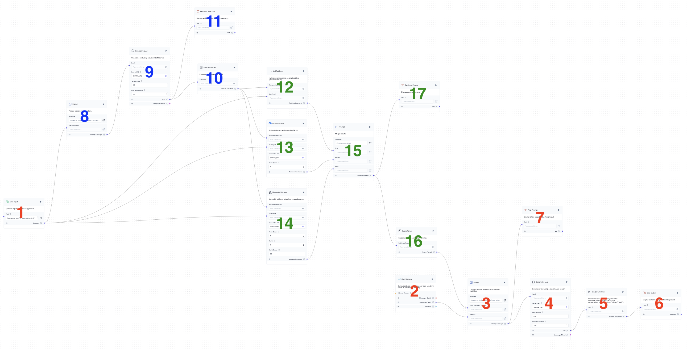

# Introduction

In this session, we will use **LangFlow** to build a chatbot with Retrieval-Augmented Generation (RAG), leveraging two knowledge bases created in `02_KnowledgeBase.ipynb`.

This flow functions as a multi-agent system with two key agents:

- **The English Poetry Professor**: Responsible for engaging with the user, offering accurate and insightful responses on themes, contexts, and implications within poetry.

- **The Professor’s Secretary**: Focused on retrieving relevant poems from the knowledge bases to support the professor’s responses and enrich the conversation.


# Starting the LLM Server

As described in `04_LangflowBase.md`, start your server as follows:

- **First, local Server**:

    ```shell
    python 03_MyLLMServer.py
    ```

- **Next, public Server**:

    ```shell
    lt --port 7777
    ```

We will refer to the output URL from `lt --port 7777` as **SERVER_URL**.

This server provides three APIs:

- **SERVER_URL/generate**: Generates text.
- **SERVER_URL/retrieve_faiss**: Similarity-based retrieval.
- **SERVER_URL/retrieve_nx_graph**: Keyword-based retrieval.

Refer to `03_MyLLMServer.py` for their implementations in the functions `generate_kernel`, `retrieve_faiss_kernel`, and `retrieve_nx_graph_kernel`.

# Poetry Chatbot

Upload `flows/PoetryMemoryChatbot.json` to LangFlow, and you will see the following flow in your workspace:



**Now, create a global variable called `SERVER_URL` (in ⚙️ Settings) and assign your public URL to its value.**

This flow may seem complex at first glance, but don’t worry—we’ll break down its structure step by step.

## Chatbot Core

Components 1 to 6 form the core of our chatbot, identical to the setup in `04_LangflowBasic.md`. The only difference is in Component 3, which uses a prompt that takes in a message `input_retrieved_poems`. This message contains the retrieved poems.

The final prompt template in Component 3 is as follows:

```plaintext
You are an English poetry professor with rich knowledge of poetic forms, themes, and historical context. 
Your task is to assist users by providing insightful and relevant responses to their queries about poetry. 

{input_retrieved_poems}

---------------------------------

{memory}

AI:
```

Component 7 is added to monitor the final prompt sent to the LLM in the Playground.

## Intent Recognition

Recognizing user intent is a key aspect of multi-agent systems. For example, if the user types "Thank you" or "Good idea," retrieval is clearly unnecessary. To handle intent recognition, we created Components 8 to 11. Component 8 is crucial, as its prompt guides the LLM to choose from three actions: skip retrieval, similarity-based retrieval, or keyword-based retrieval, as implemented in `03_MyLLMServer.py`.

Take some time to read and understand the prompt used in Component 8, as it plays a central role in guiding the system’s responses.

```plaintext
You are an English poetry expert with access to two specialized poetry databases:  
1) **Similarity Retrieval** — for finding poems that resemble a given poem or poetic text, such as content, style, mood, or example. This retrieval is based on FAISS indexing of more than 13,000 poems.
2) **Keyword Retrieval** — for finding poems based on specific keywords, which can be broad themes (e.g., "nature," "war") or more specific nouns (e.g., "tree," "car"). This retrieval is based on a NetworkX graph of more than 10,000 keywords.

**Task:** Analyze the User Query and select the best retrieval action by choosing one of the options below:

- **[A]: Skip Retrieval** — Select this if the User Query is conversational and doesn’t require poetry retrieval. Examples include:
   - Greetings, thanks, farewells, or simple acknowledgments like "Sounds good" or "Great idea."
   - Follow-up questions about the current poems, such as "Tell me more about its author", or "Explain this line further."

- **[B]: Similarity Retrieval** — Select this if the User Query includes any poem or poetic language, seeking similarity in style, mood, or content. If you detect such text, you should always choose this option.

- **[C]: Keyword Retrieval** — Select this if the User Query mentions specific keywords, such as themes (e.g., "nature," "war"), nouns (e.g., "tree," "car"), and named entities (e.g., "America", "Victoria").

User Query: {user_message}  
AI: My choice is [
```

After the LLM (Component 9) makes its selection, Component 10 parses the result, returning only "A", "B", or "C". Component 11 monitors the reasoning of the LLM.

## Poem Retrieval

Components 12 to 17 handle the actual retrieval process.

- Component 12: Skip retrieval, always returning an empty string.
- Component 13: Similarity-based retrieval, returning an empty string if the selection result is not "B". It takes one argument, `Poem Count`, which controls the number of retrieved poems.
- Component 14: Keyword-based retrieval, returning an empty string if the selection result is not "C". In addition to `Poem Count`, it also takes `Depth` and `Depth Decay` to determine the sorting score.

After retrieval, Component 15 merges the results, as monitored in Component 17.

Component 16 places the retrieved result into a prompt, instructing the LLM on how to use the retrieved content:

```python
if poems:
    # When retrieved content is available, provide guidance for the LLM on how to use it
    parsed = (
            "Based on the user query, your secretary has retrieved the following poems to help enrich your response. "
            "Use these to provide relevant insights, analyze themes, or add context for the user’s query. "
            "Note: Your secretary will present the original poems to the user, so you do not need to include them verbatim in your answer.\n\n" + poems
    )
else:
    # If no content was retrieved, skip adding any prompt
    parsed = ""
```

The `parsed` variable above will be sent to the final prompt template in Component 3 via `input_retrieved_poems`. Note that, because the user can view the full text of retrieved poems in the Playground via Component 17, we instruct the LLM not to repeat the poems in the answer to improve readability.

# Additional Exercises

- **Talk to the Chatbot in the Playground**: Test different types of queries to trigger each of the options A, B, and C. Identify any issues or areas for improvement.

- **Read and Understand Important Templates and Code**:
  - Templates for Components 3 and 8
  - Code for Components 10, 12, 13, 14, and 16

- **Consider Context in Intent Recognition**: In this application, we use the current query as the only clue for intent recognition to simplify the workflow. This requires a complete and informative user query. A more comprehensive approach would involve using the full conversation context. This would require more sophisticated logic, especially to determine the relevant text from the context for retrieval input.

- **Using Tool Calling Agents**: LangChain provides a more intelligent mechanism for implementing Chain of Thought reasoning via the [Tool Calling Agent](https://python.langchain.com/v0.1/docs/modules/agents/agent_types/tool_calling/). We can provide the retrievers as tools, describing their data and usage, and let the LLM decide which to use based on the context. This is ideal for tasks involving multiple tools (like the retrievers here) and complex workflows (e.g., chaining multiple tools in sequence).
